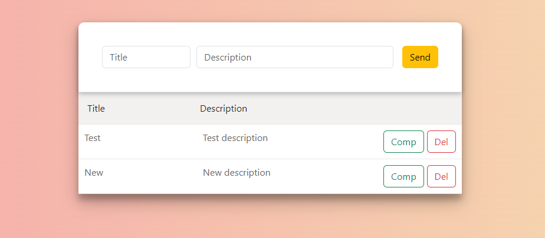

# Django-react ToDo application
This is a simple Todo application built using Django for the backend and React for the frontend.

## Features
* Add, update, and delete tasks.
* Mark tasks as completed.

## Installing
The first thing to do is to clone the repository:
```
$ git clone https://github.com/Vladislav-Sharapa/django-react-to-do-app
```
### Backend(Django) 
1. Navigate to the frontend directory:
```
$ cd backend
```
2. Create a virtual environment to install dependencies in and activate it:
```
$ python -m venv venv
```
3. Installs Python packages specified in the 'requirements.txt' file located in the 'backend' directory:
```
$ pip install -r requirements.txt
```
4. Make migrations:
```
$ python app/manage.py migrate --run-syncdb
```
5. Run server
```
$ python app/manage.py runserver
```
### Frontend(React)
1. Navigate to the frontend directory:
```
$ cd frontend
```
2. Then install all the dependencies for frontend application
```
$ yarn install
```
3. Run frontend application
```
$ yarn dev
```
